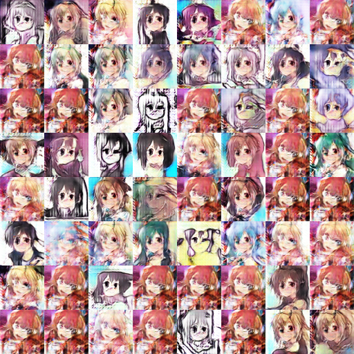

# When Waifu Meets GAN


## Dataset

We can use **get_dataset.py** script to download the [**Anime-faces dataset**](https://drive.google.com/file/d/0B4wZXrs0DHMHMEl1ODVpMjRTWEk/view?usp=sharing):

```
$ python get_dataset.py anime-faces
```

This dataset consists of 48548 pictures of anime character faces where each picture has size 96x96.

There are 3 more dataset to choose from, `celebA, lsun and mnist`.


## [DCGAN](https://arxiv.org/abs/1511.06434)

We can train DCGAN with the following code:

```
$ python main.py --train
```

And test:

```
$ python main.py
```

Here are the generated images after 60 epoches:




### Architecture guidelines for stable Deep Convolutional GANs
- Replace any pooling layers with strided convolutions (discriminator) and fractional-strided
convolutions (generator).
- Use *batchnorm* in both the generator and the discriminator.
- Remove fully connected hidden layers for deeper architectures.
- Use *ReLU* activation in generator for all layers except for the output, which uses *Tanh*.
- Use *LeakyReLU* activation in the discriminator for all layers.

### Training Details
- In the LeakyReLU, the slope of the leak was set to 0.2 in all models.
- Use the Adam optimizer with learning rate of 0.0002.


### discriminator
```python
def discriminator(self, x, reuse=False):
    with tf.variable_scope("discriminator") as scope:
        if reuse:
            scope.reuse_variables()

        # Use batch_norm and leaky_relu activation
        h0 = conv2d(x, self.df_dim, name='d_h0_conv')
        h0 = lrelu(h0)
        h1 = conv2d(h0, self.df_dim*2, name='d_h1_conv')
        h1 = batch_norm(name='d_bn1')(h1)
        h1 = lrelu(h1)
        h2 = conv2d(h1, self.df_dim*4, name='d_h2_conv')
        h2 = batch_norm(name='d_bn2')(h2)
        h2 = lrelu(h2)
        h3 = conv2d(h2, self.df_dim*8, name='d_h3_conv')
        h3 = batch_norm(name='d_bn3')(h3)
        h3 = lrelu(h3)
        h4 = tf.reshape(h3, [self.batch_size, -1])
        h4 = dense(h4, 1)

        return tf.nn.sigmoid(h4), h4
```

### generator
```python
def generator(self, z):
    with tf.variable_scope("generator") as scope:
        s_h0, s_w0 = self.output_height, self.output_width

        # size of the filter in each one of the 4 layers
        s_h1, s_w1 = conv_out_size(s_h0, s_w0, 2, 2)
        s_h2, s_w2 = conv_out_size(s_h1, s_w1, 2, 2)
        s_h3, s_w3 = conv_out_size(s_h2, s_w2, 2, 2)
        s_h4, s_w4 = conv_out_size(s_h3, s_w3, 2, 2)

        # natch_norm and relu activation
        z1 = dense(z, self.gf_dim * 8 * s_h4 * s_w4, 'g_h0_dense')
        h0 = tf.reshape(z1, [-1, s_h4, s_w4, self.gf_dim * 8])
        h0 = batch_norm(name='g_bn0')(h0)
        h0 = tf.nn.relu(h0)
        h1 = deconv2d(h0, [self.batch_size, s_h3, s_w3, self.gf_dim * 4], name='g_h1')
        h1 = batch_norm(name='g_bn1')(h1)
        h1 = tf.nn.relu(h1)
        h2 = deconv2d(h1, [self.batch_size, s_h2, s_w2, self.gf_dim * 2], name='g_h2')
        h2 = batch_norm(name='g_bn2')(h2)
        h2 = tf.nn.relu(h2)
        h3 = deconv2d(h2, [self.batch_size, s_h1, s_w1, self.gf_dim * 1], name='g_h3')
        h3 = batch_norm(name='g_bn3')(h3)
        h3 = tf.nn.relu(h3)
        h4 = deconv2d(h3, [self.batch_size, s_h0, s_w0, self.c_dim], name='g_h4')

        # output activation tanh
        return tf.nn.tanh(h4)
```

## Credits
Thanks Taehoon Kim for his [DCGAN-tensorflow](https://github.com/carpedm20/DCGAN-tensorflow) implementation, and [Jie Lei](https://github.com/jayleicn/animeGAN) for the collection of anime-faces dataset.